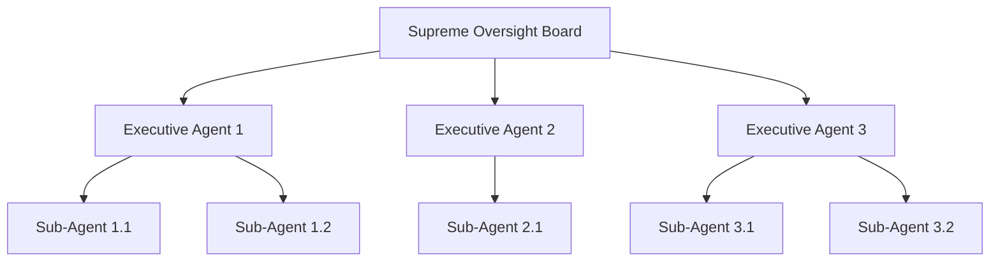
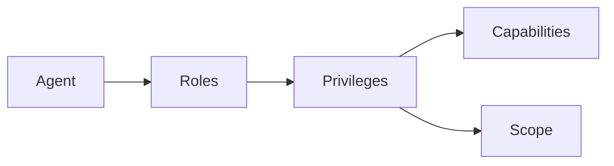
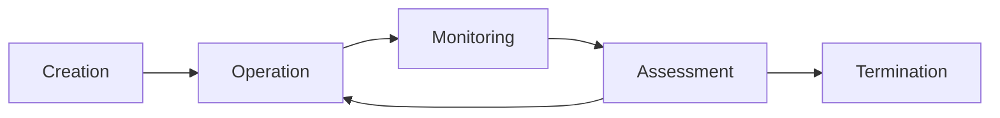
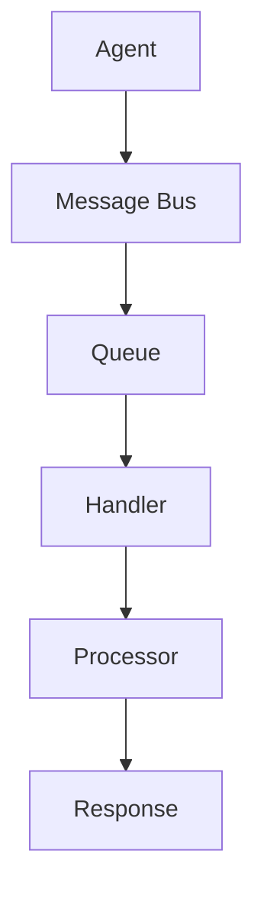

# System Patterns

## System Architecture

### Hierarchical Structure

1. **Tier 0: Supreme Oversight Board (SOB)**
   - Highest level of authority
   - Composed of archetypal agents
   - Ethical decision-making body
   - System-wide governance

2. **Tier 1: Executive Agents**
   - Domain-specific management
   - Strategic planning and execution
   - Resource allocation
   - Sub-agent coordination

3. **Tier 2+: Sub-Agents**
   - Specialized task execution
   - Focused capabilities
   - Limited scope
   - Direct reporting lines

## Design Patterns

### Role-Based Access Control (RBAC)

1. **Role Definition**
   - Hierarchical position
   - Functional responsibilities
   - Access permissions
   - Operational boundaries

2. **Privilege Inheritance**
   - Top-down flow of authority
   - Subset-based permissions
   - Capability restrictions
   - Scope limitations

3. **Access Control**
   - Resource protection
   - Function restrictions
   - Data security
   - Operation validation

### Agent Lifecycle Management

1. **Creation Protocol**
   - Parameter validation
   - Resource allocation
   - Role assignment
   - Initial configuration

2. **Operational Monitoring**
   - Performance tracking
   - Error detection
   - Resource usage
   - Task completion

3. **Termination Handling**
   - Resource cleanup
   - State preservation
   - Chain of command updates
   - System stability maintenance

## Component Relationships

### Inter-Agent Communication

1. **Message Patterns**
   - Command messages
   - Event notifications
   - Status updates
   - Error reports

2. **Communication Flow**
   - Hierarchical routing
   - Priority handling
   - Load balancing
   - Error recovery

3. **State Management**
   - Consistency maintenance
   - Transaction handling
   - Conflict resolution
   - History tracking

## Technical Decisions

### API Integration

1. **OpenAI Agent APIs**
   - Latest agent endpoints
   - Authentication handling
   - Rate limiting
   - Error management

2. **Custom Extensions**
   - Function implementations
   - Tool integration
   - Resource management
   - Performance optimization

### System Implementation

1. **Core Components**
   - Agent manager
   - Communication bus
   - Resource controller
   - Monitor service

2. **Support Services**
   - Logging system
   - Metrics collection
   - Diagnostic tools
   - Development utilities

### Error Handling

1. **Detection Mechanisms**
   - Performance monitoring
   - Error pattern recognition
   - Anomaly detection
   - Resource tracking

2. **Recovery Procedures**
   - Automatic correction
   - Failover handling
   - State recovery
   - System restoration

## Evolution Strategy

### Capability Enhancement

1. **Learning Pipeline**
   - Performance analysis
   - Pattern recognition
   - Knowledge integration
   - Capability expansion

2. **Adaptation Mechanism**
   - Environmental response
   - Workload adjustment
   - Resource optimization
   - Protocol updates

### System Scaling

1. **Horizontal Growth**
   - Agent multiplication
   - Load distribution
   - Resource allocation
   - Network expansion

2. **Vertical Enhancement**
   - Capability depth
   - Processing power
   - Storage capacity
   - Function complexity
